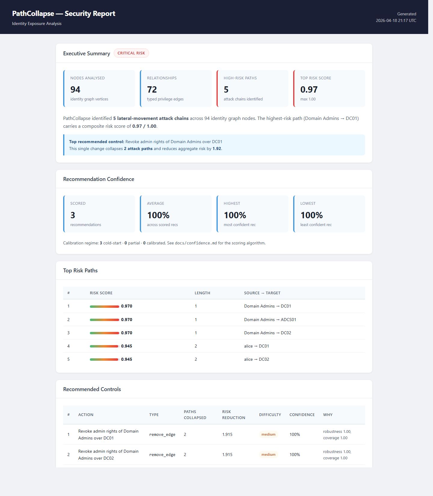

# PathCollapse

[](https://github.com/karthikarunapuram8-dot/pathcollapse/actions/workflows/ci.yml)
[](https://goreportcard.com/report/github.com/karthikarunapuram8-dot/pathcollapse)
[](LICENSE)

**Graph-based identity exposure analysis that finds the smallest fixes with the biggest security impact.**

PathCollapse ingests identity and policy metadata from enterprise environments, constructs a typed privilege/exposure graph, reasons over realistic escalation and blast-radius paths, then computes the **minimal control changes** that collapse the highest-risk paths.

> **Purely defensive.** PathCollapse is an analytics and reporting tool. It performs no network scanning, credential access, or attack execution.



Real CLI output with calibrated recommendation confidence enabled:

```text
$ pathcollapse breakpoints --top 3 --confidence on
INFO: using built-in fixture (pass --graph <snapshot.json> to use ingested data)
INFO: confidence: no snapshot history at C:\Users\RDPUser\.pathcollapse\snapshots.db — T(e) using cold-start prior (see docs/confidence.md §4.4)
Top 3 control breakpoints (15 paths analysed, ordered by paths collapsed):

1. Remove can_write_acl_of relationship from Account Operators to Domain Admins
   type=remove_edge           paths-collapsed=6    risk-reduction=5.442  difficulty=medium  confidence=100%
   drivers: E=0.36 R=1.00 S=0.72 T=0.30 K=1.00  regime=cold_start

2. Remove alice from group Domain Admins
   type=remove_member         paths-collapsed=4    risk-reduction=3.755  difficulty=low     confidence=100%
   drivers: E=0.41 R=1.00 S=0.48 T=0.30 K=1.00  regime=cold_start
```

---

## Features

- **Typed identity graph** — 15 node types, 17 edge types covering AD/Entra ID relationships
- **Multi-mode path reasoning** — Reachability, Plausibility (condition-filtered), and full Defensive analysis
- **Greedy breakpoint optimizer** — set-cover algorithm finds the fewest changes with the most impact
- **Calibrated recommendation confidence** — five-factor decomposable score (evidence, robustness, safety, temporal stability, coverage concentration) with isotonic calibration; replaces the legacy static value and ships with per-factor explanations and a `--confidence=on|off` CLI flag. See [docs/confidence.md](docs/confidence.md).
- **Detection mapper** — generates path-aware ATT&CK mappings, log-source guidance, telemetry requirements, and templated Sigma/KQL/SPL content
- **Drift detection** — snapshot diffing highlights new privileged memberships, delegation changes, cert template drift
- **SQLite snapshot persistence** — save, list, diff, and prune graph snapshots with `pathcollapse snapshot`
- **HTML reports** — single-file CISO-ready reports with executive summary, risk paths, breakpoints, detection content, telemetry guidance, and drift
- **Analyst DSL** — human-readable query language: `FIND PATHS FROM user:alice TO privilege:tier0 WHERE confidence > 0.7`
- **Multiple ingestion formats** — Generic JSON, CSV (users/groups/admins/GPOs), BloodHound JSON exports, YAML facts

---

## Installation

### Pre-built binaries (recommended)

Download the latest release for your platform from [GitHub Releases](https://github.com/karthikarunapuram8-dot/pathcollapse/releases):

```bash
# macOS / Linux — extract and move to PATH
tar xzf pathcollapse_*_darwin_arm64.tar.gz
mv pathcollapse /usr/local/bin/
```

### Build from source

```bash
git clone https://github.com/karthikarunapuram8-dot/pathcollapse
cd pathcollapse
go build ./cmd/pathcollapse
```

Or install all binaries:

```bash
go install ./cmd/...
```

**Requirements**: Go 1.25+ (see `go.mod`)

### Performance

See [BENCHMARKS.md](BENCHMARKS.md) for latency and memory numbers.

---

## Why PathCollapse

BloodHound is excellent at graphing privilege relationships and finding attack paths. PathCollapse is aimed at a different question:

- **Not just "what paths exist?" but "which few control changes collapse the most risk?"**
- **Defender-first output** with breakpoint recommendations, drift reports, ATT&CK mappings, telemetry requirements, and report-ready artifacts
- **Operational prioritization** via tunable scoring, ranked paths, and greedy set-cover optimization

If BloodHound helps answer *how an attacker could move*, PathCollapse is trying to answer *what a defender should fix first*.

---

## Quick Start

### Ingest from JSON

```bash
pathcollapse ingest --input identity-data.json --type json --output snapshot.json
```

### Analyse paths

```bash
# Find all paths from alice to any tier-0 asset (uses ingested snapshot)
pathcollapse analyze --graph snapshot.json \
  --query "FIND PATHS FROM user:alice TO privilege:tier0 LIMIT 10"

# Find the minimal breakpoints to collapse top paths
pathcollapse analyze --graph snapshot.json \
  --query "FIND BREAKPOINTS FOR top_paths LIMIT 5"

# Show drift relative to a prior snapshot
pathcollapse analyze --graph snapshot-feb.json --baseline snapshot-jan.json \
  --query "SHOW DRIFT"
```

### Generate a report

```bash
pathcollapse report --graph snapshot.json --format markdown --top 20
pathcollapse report --graph snapshot.json --format json --output report.json

# HTML report for CISO review, including ATT&CK mappings, telemetry guidance,
# and generated detection content
pathcollapse report --graph snapshot.json --format html --output report.html
pathcollapse report --graph snapshot.json --baseline baseline.json --format html --output drift-report.html

# Disable calibrated recommendation confidence and emit the legacy static 0.85
pathcollapse report --graph snapshot.json --format markdown --confidence off
```

Reports now include:
- Ranked attack paths and breakpoint recommendations
- Path-specific ATT&CK mappings and log sources
- Generated Sigma, KQL, and SPL content seeded with path context
- Telemetry requirements and known visibility gaps

### Diff two snapshots

```bash
# File-based diff
pathcollapse diff snapshot-jan.json snapshot-feb.json
```

### Snapshot persistence (SQLite)

```bash
# Save a named snapshot to ~/.pathcollapse/snapshots.db
pathcollapse snapshot save --name weekly-jan --graph snapshot.json

# List all stored snapshots
pathcollapse snapshot list

# Compare two stored snapshots by ID (uses drift engine)
pathcollapse snapshot diff 1 3

# Prune old snapshots, keeping at least 5 recent ones
pathcollapse snapshot prune --older-than 90 --keep-min 5
```

### Compute breakpoints directly

```bash
pathcollapse breakpoints --graph snapshot.json --top 10

# Legacy static 0.85 confidence (skip calibrated scoring)
pathcollapse breakpoints --graph snapshot.json --top 10 --confidence off
```

Each recommendation includes a calibrated `confidence` (default) with a
per-factor breakdown `E=evidence R=robustness S=safety T=temporal K=coverage`
and a `regime` label (`cold_start` / `partial` / `calibrated`) reflecting
how much labeled outcome data the active calibrator was fit against. When
no snapshot history is available at `~/.pathcollapse/snapshots.db`, the
tool prints a single stderr note and falls back to the cold-start prior
for the temporal factor T(e). Pass `--confidence off` on either
`breakpoints` or `report` to disable the system entirely and restore the
legacy static `0.85` value on every recommendation. The default is `on` for
both `breakpoints` and `report`.

See [docs/confidence.md](docs/confidence.md) for the full algorithm.

---

## Architecture Overview

```
Ingestion (pkg/ingest)
    │  JSON / CSV / BloodHound / YAML
    ▼
Normalization (pkg/normalize)
    │  dedup, canonicalize
    ▼
Graph Engine (pkg/graph)
    │  adjacency list, 100K nodes / 1M edges target
    ├──► Scoring (pkg/scoring)
    │        RiskScore formula, configurable weights
    ├──► Reasoning (pkg/reasoning)
    │        Reachability / Plausibility / Defensive modes
    ├──► Controls (pkg/controls)
    │        Greedy set-cover breakpoint optimizer
    ├──► Confidence (pkg/confidence)
    │        Five-factor calibrated scoring per recommendation
    ├──► Detection (pkg/detection)
    │        Sigma / KQL / SPL generation, ATT&CK mapping
    ├──► Drift (pkg/drift)
    │        Snapshot comparison, blast-radius delta
    └──► Reporting (pkg/reporting)
             Executive + engineer reports, Markdown / JSON / HTML with detection content
```

---

## Supported Ingestion Formats

| Adapter | Flag | Description |
|---------|------|-------------|
| Generic JSON | `--type json` | PathCollapse native format |
| CSV Users | `--type csv_users` | `id,name,type,tags` |
| CSV Groups | `--type csv_groups` | `member_id,group_id` |
| CSV Local Admin | `--type csv_local_admin` | `user_id,computer_id,confidence` |
| CSV GPO | `--type csv_gpo` | `gpo_id,ou_id,gpo_name` |
| BloodHound JSON | `--type bloodhound` | Read-only parser for BH collector exports |
| YAML Facts | `--type yaml` | Analyst-provided manual relationships |

---

## DSL Query Language

```
# Find lateral movement paths
FIND PATHS FROM user:alice TO privilege:tier0 WHERE confidence > 0.7 ORDER BY risk DESC LIMIT 10

# Find optimal control breakpoints
FIND BREAKPOINTS FOR top_paths LIMIT 5

# Show drift since last snapshot
SHOW DRIFT SINCE last_snapshot

# Find high-risk service accounts
FIND HIGH_RISK_SERVICE_ACCOUNTS
```

See [docs/query-language.md](docs/query-language.md) for the full reference.

---

## Risk Scoring Formula

```
RiskScore = (TargetCriticality × 0.30)
          + (Confidence × 0.20)
          + (Exploitability × 0.20)
          + ((1 - Detectability) × 0.15)
          + (BlastRadius × 0.15)
```

All weights are tunable via `ScoringConfig`. See [docs/scoring.md](docs/scoring.md).

---

## Package Layout

| Package | Role |
|---------|------|
| `pkg/model` | Core domain types: Node, Edge, enums |
| `pkg/graph` | Graph engine: adjacency, traversal, path search |
| `pkg/scoring` | Risk scoring functions |
| `pkg/ingest` | Ingestion adapters |
| `pkg/normalize` | Data canonicalization |
| `pkg/reasoning` | Three analysis modes |
| `pkg/controls` | Breakpoint optimizer |
| `pkg/confidence` | Five-factor calibrated confidence scoring (see [docs/confidence.md](docs/confidence.md)) |
| `pkg/detection` | Sigma/KQL/SPL generation |
| `pkg/drift` | Snapshot diffing |
| `pkg/query` | DSL lexer + parser + executor |
| `pkg/reporting` | Markdown, JSON, and HTML report rendering |
| `pkg/snapshot` | SQLite-backed graph snapshot persistence |
| `pkg/policy` | Policy rule evaluation |
| `pkg/telemetry` | Telemetry requirement mapping |
| `pkg/evidence` | Evidence reference management |

---

## Current Status

### What works today

| Capability | Status |
|-----------|--------|
| Graph engine (nodes/edges/traversal) | ✅ Fully implemented |
| JSON / CSV / BloodHound / YAML ingest | ✅ Implemented with tests |
| Risk scoring (configurable weights) | ✅ Implemented with tests |
| Path finding (iterative DFS, depth-limited) | ✅ Implemented with tests |
| Breakpoint optimizer (greedy set-cover) | ✅ Implemented with tests |
| Calibrated recommendation confidence | ✅ Five-factor decomposition, log-odds aggregation, isotonic calibrator, `--confidence=on\|off` flag on `breakpoints` and `report` |
| Snapshot-backed temporal factor T(e) | ✅ `pkg/snapshot.Presence` indexes recent snapshots; cold-start stderr note when history is unavailable |
| DSL lexer + parser | ✅ Implemented with tests |
| `FIND PATHS` query execution | ✅ Returns ranked paths |
| `FIND BREAKPOINTS` query execution | ✅ Returns control recommendations |
| `SHOW DRIFT` query execution | ✅ Requires `--baseline` flag; calls `drift.CompareSnapshots` |
| Markdown / JSON / HTML reporting | ✅ Implemented with tests |
| Detection + telemetry in reports | ✅ Path-aware ATT&CK, log sources, telemetry guidance, and generated Sigma/KQL/SPL content |
| Drift detection (CompareSnapshots) | ✅ Detects 4 drift categories |
| `ingest` CLI subcommand | ✅ Reads files, writes snapshots |
| `analyze` CLI subcommand | ✅ DSL queries against snapshot or fixture |
| `breakpoints` CLI subcommand | ✅ Greedy optimizer over snapshot or fixture |
| `report` CLI subcommand | ✅ Markdown/JSON/HTML report over snapshot or fixture |
| `diff` CLI subcommand | ✅ Drift report between two snapshots |
| `snapshot` CLI subcommand | ✅ save/list/diff/prune via SQLite at `~/.pathcollapse/snapshots.db` |
| HTML report generation | ✅ Single-file self-contained report for CISO review |
| GitHub Actions CI | ✅ Build, vet, race detector, goreleaser check |
| Integration test (full pipeline) | ✅ `test/integration/pipeline_test.go` |

### Experimental / partial packages

| Package | Status |
|---------|--------|
| `pkg/policy` | Experimental — evaluator shell exists, but the rule set and CLI integration are incomplete |
| `pkg/evidence` | Partial — data structures and store helpers exist, but ingestion pipelines do not populate them yet |
| `pkg/telemetry` | Partial — requirement mapping is implemented, but there is no live telemetry collection or validation pipeline |
| Detection (Sigma/KQL/SPL) | Partial — generated from generic templates with path context; not yet deeply specialized per edge sequence |

The core product path today is: `ingest` → `graph/query/scoring` → `controls` → `reporting` / `snapshot` / `drift`.

### Verified demo workflow

```bash
# Ingest the built-in fixture dataset
./pathcollapse ingest --input internal/testdata/enterprise_ad.json \
  --type json --output /tmp/snapshot.json

# Find attack paths from alice to tier-0
./pathcollapse analyze --graph /tmp/snapshot.json \
  --query "FIND PATHS FROM user:alice TO privilege:tier0 LIMIT 5"

# Compute minimal breakpoints (calibrated confidence enabled by default)
./pathcollapse breakpoints --graph /tmp/snapshot.json --top 5

# Same run, but with calibrated confidence disabled (restores the legacy
# static 0.85 value on every recommendation — useful for A/B comparisons)
./pathcollapse breakpoints --graph /tmp/snapshot.json --top 5 --confidence off

# Generate a full markdown report with confidence summary + driver lines
./pathcollapse report --graph /tmp/snapshot.json --format markdown --top 5
```

---

## Contributing

PathCollapse is open-source and welcomes contributions. Please open an issue before submitting large changes.

```bash
go test ./...
go vet ./...
```

### CI gate

Every pull request must pass the race detector before merging:

```bash
go test -race ./...
```

### Profiling

A `Makefile` is provided for common profiling tasks:

```bash
make bench        # run all benchmarks with allocation counts
make cpu-profile  # capture CPU profile for FindPaths (writes cpu.prof)
make mem-profile  # capture heap profile for FindPaths (writes mem.prof)
make race         # run full test suite under the race detector
```

---

## License

Apache 2.0
